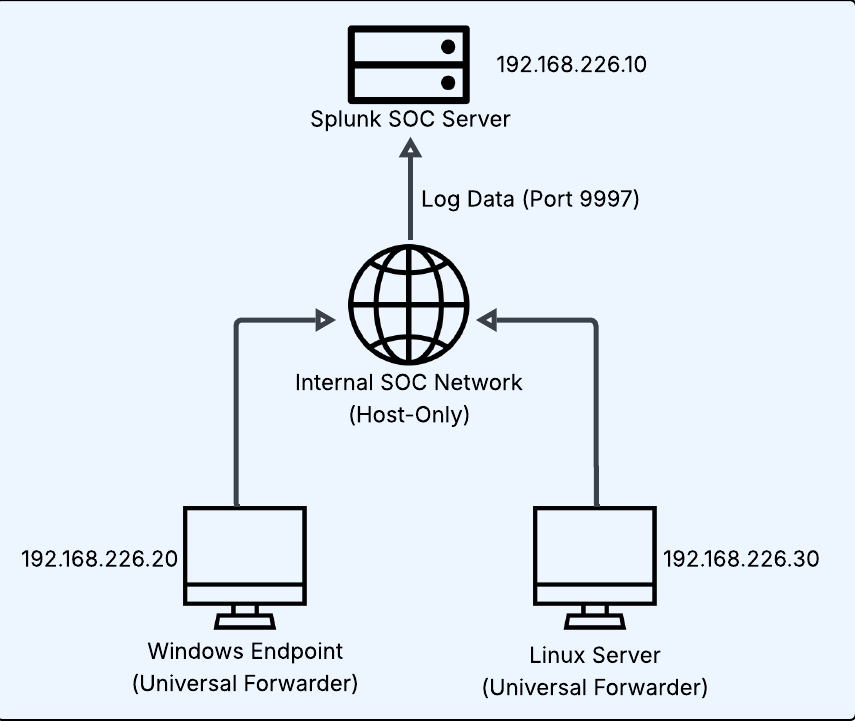
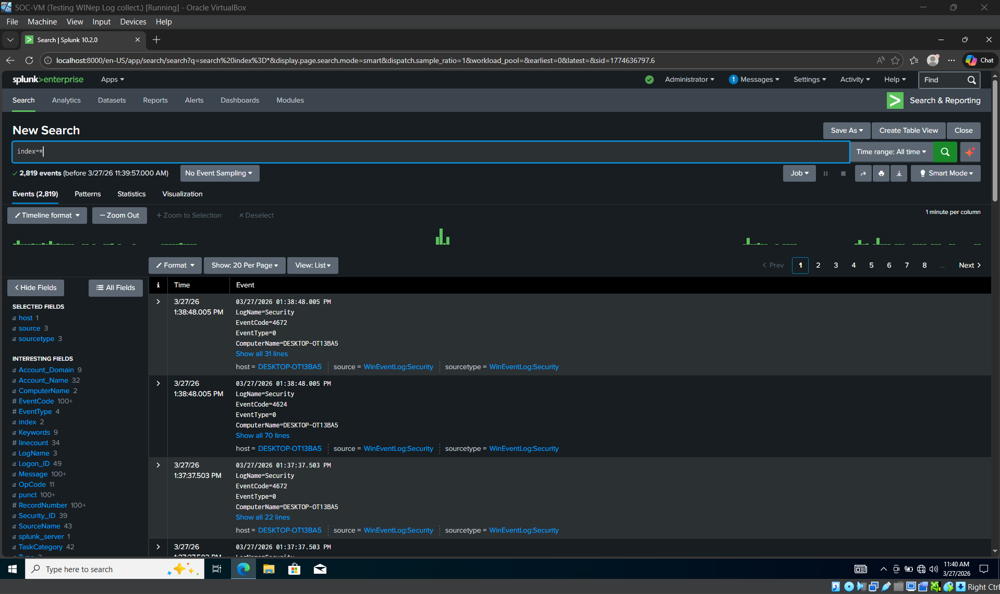

# SOC Lab: AI-Assisted Log Analysis in a Security Operations Center Environment

## Overview
This project documents the design and implementation of a small virtualized Security Operations Center (SOC) lab built to simulate real-world log collection, threat detection, and investigation workflows.

The lab was developed as part of a cybersecurity capstone project titled **"Evaluating AI-Assisted Log Analysis in a Security Operations Center Environment."** The goal was to build a hands-on environment that demonstrates foundational SOC skills, including centralized log ingestion, event analysis, detection logic, and investigation of suspicious activity across Windows and Linux systems.

This project reflects a blue-team-focused approach to cybersecurity and is intended to showcase practical experience relevant to SOC analyst and threat detection internship roles.

---

## Project Objectives
- Build a small virtual SOC lab using a Windows endpoint, Linux Ubuntu server, and Splunk SIEM
- Centralize logs from multiple systems into a SIEM platform
- Simulate security-relevant activity to generate realistic telemetry
- Investigate events manually using log analysis workflows
- Evaluate how AI-assisted analysis can support, but not replace, analyst decision-making
- Develop practical experience with detection workflows, log interpretation, and SOC documentation

---

## Lab Architecture
The lab environment consists of the following components:

- **Windows endpoint**
  - Used to generate endpoint and authentication-related events
- **Linux server (Ubuntu CLI)**
  - Used to generate server and authentication logs
- **Splunk SIEM**
  - Used for centralized log ingestion, search, and analysis

### High-Level Workflow
1. Systems generate operating system and security-relevant logs
2. Logs are forwarded or ingested into Splunk
3. Attack simulations and suspicious activity create detectable events
4. Events are reviewed manually and compared against AI-assisted analysis workflows

> SOC Lab Architecture Diagram

  

---

## Technologies Used
- **SIEM:** Splunk
- **Operating Systems:** Windows, Ubuntu Linux CLI
- **Virtualization:** Hyper-V / Virtual lab environment
- **Security / Networking Exposure:** Active Directory, Cisco networking, Palo Alto firewalls
- **Security Tool Familiarity:** Kali Linux, Metasploit, Burp Suite, Autopsy
- **Cloud Exposure:** AWS fundamentals

---

## Attack Simulations / Security Scenarios
The following scenarios were used to generate logs and practice investigation workflows:

- Repeated failed login attempts
- Authentication-related anomalies
- Suspicious access patterns across hosts
- Log review across both Windows and Linux sources
- Comparison of normal vs suspicious events in Splunk searches

> Note: This project was designed for defensive analysis and security education. The focus was on detection, log visibility, and investigation rather than offensive exploitation.

---

## Detection and Investigation Workflow
This project focused on the analyst side of security operations.

### Example workflow:
1. Generate or identify suspicious activity in the lab
2. Review related logs in Splunk
3. Filter by host, source, user, event type, and time window
4. Identify patterns such as repeated failures, unusual authentication behavior, or cross-system indicators
5. Document findings and assess whether the activity appears benign, suspicious, or worthy of escalation

### Sample investigation questions
- Which host generated the event?
- Which user account was involved?
- Was the activity isolated or repeated?
- Did similar events occur across multiple systems?
- Does the pattern indicate misconfiguration, user error, or possible malicious activity?

---

## AI-Assisted Log Analysis Component
A key part of this project was evaluating how AI can assist SOC workflows.

### Areas where AI was helpful
- Summarizing large volumes of event output
- Assisting with pattern recognition during log review
- Helping organize observations into clear documentation
- Supporting junior-analyst-style triage and interpretation

### Limitations observed
- AI should not be treated as a source of truth
- Context from the analyst is still required
- Detection quality depends on the quality of telemetry and prompts
- Human validation is necessary to avoid incorrect conclusions

### Conclusion
AI can improve efficiency in log review and documentation, but it does not replace analyst judgment, validation, or understanding of systems and security context.

---

## Screenshots
### Splunk Search Overview

### Windows Event Investigation

### Linux Log Analysis

### Failed Logon Review

---

## Key Skills Demonstrated
- SIEM fundamentals and log analysis
- Multi-system visibility across Windows and Linux
- Detection-oriented thinking
- SOC investigation workflow
- Security documentation and reporting
- Understanding of AI-assisted security analysis limitations and benefits

---

## Project Outcomes
Through this lab, I strengthened my understanding of:
- how logs move from systems into a SIEM
- how analysts investigate suspicious activity using event data
- how to structure detections and investigations clearly
- how AI can support triage and analysis in a controlled SOC workflow

This project helped bridge classroom cybersecurity concepts with practical blue-team-oriented implementation.

---

## Repository Contents
- `docs/` – project documentation and analysis notes
- `diagrams/` – lab architecture and data flow visuals
- `screenshots/` – Splunk searches, dashboards, and investigation examples
- `detections/` – sample detections, use cases, and search logic
- `setup/` – build notes for lab components
- `reports/` – findings, summary, and project reflections

---

## Future Improvements
- Expand telemetry sources and data volume
- Add more structured detections and alert logic
- Improve dashboarding and visualization in Splunk
- Add simple automation for log parsing or triage support
- Incorporate additional endpoint or server scenarios for broader coverage

---

## Author
**Nick [Last Name]**  
Cybersecurity student focused on SOC, threat detection, and hands-on blue team development.

LinkedIn: [Add your LinkedIn URL]  
Resume: [Optional link if hosted]  
